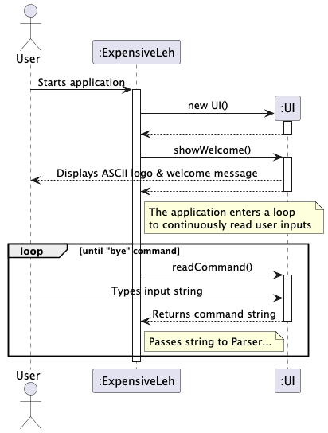
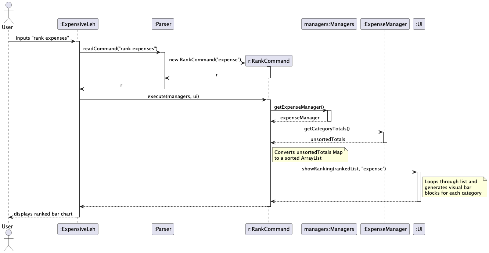

# Developer Guide

## Acknowledgements

{list here sources of all reused/adapted ideas, code, documentation, and third-party libraries -- include links to the original source as well}

## Design 

## Implementation

### Application Startup and Main Loop

The startup phase handles the initialization of core components—specifically the User Interface (`UI`)—and establishes the main execution loop that continuously listens for and processes user commands.

The sequence diagram below illustrates the interactions that occur when the user first launches the `ExpensiveLeh` application.

**How the startup and main loop execution works:**

1. When the user launches the application, the main `ExpensiveLeh` class begins its execution.
2. `ExpensiveLeh` creates a new instance of the `UI` class to handle user interactions.
3. `ExpensiveLeh` invokes the `showWelcome()` method on the `UI` object.
4. The `UI` component prints the application's custom ASCII logo and a welcome greeting to the user's console.
5. Following the greeting, the application enters a continuous `loop` that remains active until the exit command ("bye") is triggered.
6. Within this loop, `ExpensiveLeh` calls `ui.readCommand()` to pause execution and wait for the user to type something.
7. The user types a command string into the terminal.
8. When this happens, the `UI` component captures this input and returns the raw command string back to `ExpensiveLeh`.
9. `ExpensiveLeh` then passes this raw string over to the `Parser` component to be interpreted and executed, which eventually leads to specific command flows.

### Rank Feature

The rank feature allows users to visualize their spending habits or loan distributions by displaying an ordered ASCII bar chart. It supports ranking both expenses (by category) and loans (by person).

The feature is facilitated by `RankCommand`. It relies on `ExpenseManager` or `LoanManager` to calculate the aggregate totals, and the `UI` component to render the visual representation.

The sequence diagram below illustrates the interactions within the system when a user executes the `rank expenses` command.

**How the `RankCommand` execution works:**

1. When the user inputs `rank expenses`, the `Parser` reads the command string.
2. The `Parser` identifies the "expenses" keyword and creates a new `RankCommand` object, passing `"expense"` as the type flag.
3. The `execute(managers, ui)` method is called on the `RankCommand` object.
4. `RankCommand` accesses the central `Managers` object to retrieve the `ExpenseManager`. *(Note: If the command was `rank loans`, it would retrieve the `LoanManager` instead. More details written below).*
5. It calls `getCategoryTotals()` on the `ExpenseManager`, which returns a map containing each category and its total aggregated amount.
6. The `RankCommand` converts this unsorted map into an `ArrayList` and sorts it in descending order based on the monetary values.
7. Finally, `RankCommand` invokes `ui.showRanking()`, passing in the sorted list and the type flag. The `UI` component loops through the list, calculates the proportional length of the ASCII bar for each item relative to the highest amount, and displays the formatted chart to the user.

The same method of execution works for the user input `rank loans` as well. In this similar case, `Parser` identifies the "loans" keyword and carries out the same execution, however, it instead retrieves `LoanManager` and calls `getPersonsTotals()`, which returns a map containing the total aggregated, owed amounts, grouped by person. 

## Product scope
### Target user profile

Busy students who want to manage their spending

### Value proposition

Students who are busy require an easy and convenient way to manage their finances. Our product serves as an easy way for
them to track their expenses so that they do not overspend their budgets.

## User Stories

| Version | As a ...  | I want to ...                                               | So that I can ...                                                  |
|---------|-----------|-------------------------------------------------------------|--------------------------------------------------------------------|
| v1.0    | user      | see my past expenses                                        | track my total expenditure                                         |
| v1.0    | user      | log an expense using a single command                       | record expenses quickly without navigating through multiple inputs |
| v2.0    | user      | add people who owe me money                                 | remember to chase them to return my money                          |
| v2.0    | user      | mark people who have returned money owed                    | stop chasing them for money                                        |
| v2.0    | user      | know my remaining budget immediately after logging expenses | know how much money I have saved                                   |
| v2.0    | lazy user | bookmark frequent expenses and add them                     | log them easily without typing everything out                      |

## Non-Functional Requirements

{Give non-functional requirements}

## Glossary

* *glossary item* - Definition

## Instructions for manual testing

{Give instructions on how to do a manual product testing e.g., how to load sample data to be used for testing}
